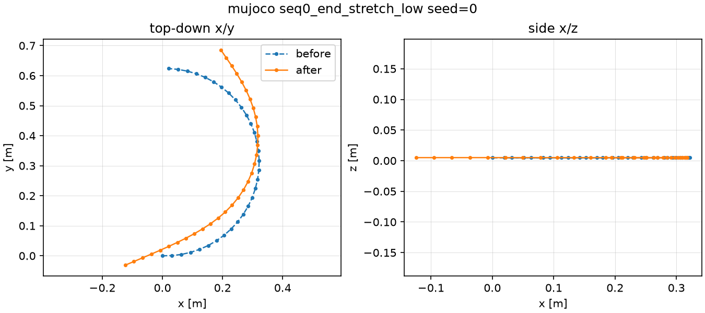
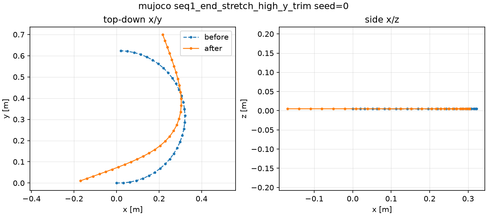
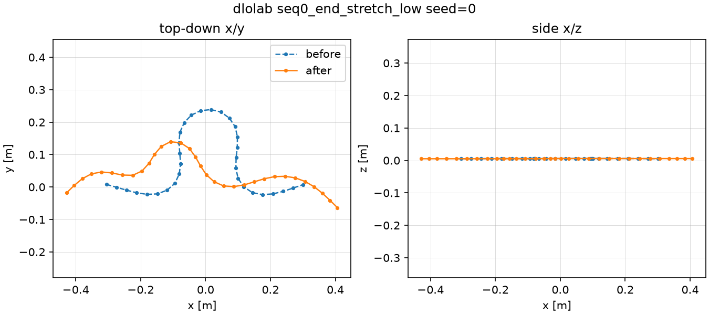
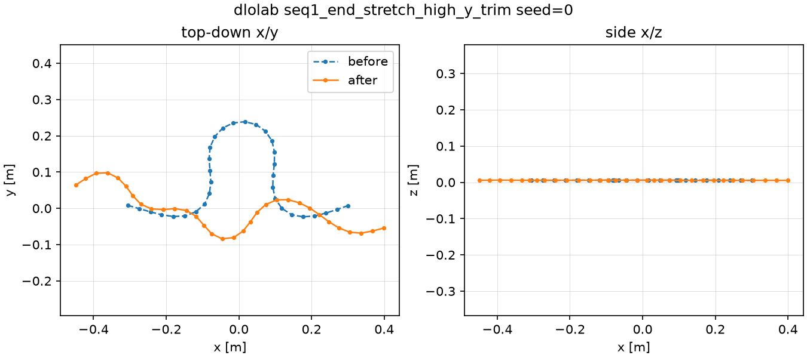

# M1 Simulator Comparison

- commit: `4390ec79536473ca51e28ec61f07cdf91ba42113`
- seeds: `[0, 1, 2]`
- metrics: [`outputs/metrics/sim_comparison_metrics.json`](../metrics/sim_comparison_metrics.json)
- scripted workload: 5 sequences × 3 seeds × 2 sims

## 설치 난이도/소요

| sim | 설치/구동 메모 |
| --- | --- |
| MuJoCo cable | `mujoco 3.10.0`; CPU 실행; gravity+ground-plane scene; MJX는 cable plugin 미지원. MuJoCo 3.10 cable body names are `ropeB_first`/`ropeB_*`/`ropeB_last`, so the adapter enumerates generated names dynamically. Weld grasp uses identity relpose plus mocap pre-positioning to avoid snap. |
| DLO-Lab | install SUCCESS under the 2 h timebox: `external/DLO-Lab` clone `c5026a9`, `torch 2.10.0+cu128` ~95 s, editable `genesis-world 1.0.0` extras ~87 s. Resolver pins: `numpy<2.5`, `fsspec<=2026.2.0`, `packaging<26.0`; `uv pip check` clean. SharePoint assets returned HTTP 401 but were not needed for `ParameterizedRod`. Runtime alias `gs.ti_float=gs.qd_float` is required for the DLO-Lab 1.0.0 bug; external source remains unpatched. |

## smoke 통과 여부

두 sim 모두 smoke PASS이며 MuJoCo 단독 통과 상태가 아니다.

| sim | result | log | key facts |
| --- | --- | --- | --- |
| MuJoCo cable | PASS 7/7 | `outputs/reports/smoke_mujoco_stdout.log` | primitive wall-time 2.62 s; settle 2653 steps; low lift; small delta; no NaN. |
| DLO-Lab | PASS 8/8 | `outputs/reports/smoke_dlolab_stdout.log` | primitive wall-time 4.34 s; stiffness×2 vs ×1 final-shape L2 diff 0.196; GPU batch `n_envs=4`; no NaN. |

## primitive wall-time

Measured by this comparison run around each grasp→move→release→settle primitive.

| sim | primitives | mean wall-time [s] | max wall-time [s] |
| --- | ---: | ---: | ---: |
| MuJoCo cable | 30 | 5.8256 | 6.6293 |
| DLO-Lab | 30 | 4.7724 | 11.9963 |

## settle 안정성

Comparison threshold: velocity `< 0.001` with max 5000 steps per primitive. DLO-Lab smoke high-lift detach needed 7771 steps at the same 1e-3 threshold, hence smoke used max_steps 12000.

**메트릭 정의 주의:** convergence는 sim별로 다른 속도 정의를 쓴다 — MuJoCo는 `max_abs_qvel`(관절공간, 153 DOF 혼합), DLO-Lab은 `max_node_speed`(노드 cartesian 속도). §5는 둘 다 허용하지만 0.0% vs 100.0% 수치는 부분적으로 정의 차이를 포함하므로 직접 비교에 주의가 필요하다 (M2 판단 시 참고).

| sim | convergence rate | non-converged | settle steps mean | settle steps max | NaN failures | straightness Δ/sequence mean |
| --- | ---: | ---: | ---: | ---: | ---: | ---: |
| MuJoCo cable | 0.0% | 30 | 5000.0 | 5000 | 0 | 0.1612 |
| DLO-Lab | 100.0% | 0 | 1471.7 | 3935 | 0 | 0.0214 |

## 파라미터화 커버리지

| axis | MuJoCo cable | DLO-Lab |
| --- | --- | --- |
| length / segments | Regen-MJCF path covers `length_m` and `n_segments`. | `ParameterizedRod` rebuild covers length and vertices. |
| bend | Cable plugin bend multiplier. | Runtime `set_bending_stiffness` setter. |
| twist | Cable plugin twist multiplier. | Runtime `set_twisting_stiffness` setter. |
| friction | Geom/plane friction from `RopeParams.friction`. | Runtime `set_mu_s`/`set_mu_k` setters. |
| plasticity | Not supported by the MuJoCo cable adapter. | DLO-Lab runtime setters include `plastic_yield`/`creep`; DGCC P0 keeps them inactive until @M6. |

## 병렬화

| sim | status |
| --- | --- |
| MuJoCo cable | CPU single-process adapter. MJX cable path unsupported because the cable plugin is not available in MJX. |
| DLO-Lab | GPU headless path works; smoke verified batched `n_envs=4` with `sample_centerline(32).shape == (4, 32, 3)`. |

## 육안 궤적 플롯

- mujoco `seq0_end_stretch_low` seed=0: 
- mujoco `seq1_end_stretch_high_y_trim` seed=0: 
- dlolab `seq0_end_stretch_low` seed=0: 
- dlolab `seq1_end_stretch_high_y_trim` seed=0: 

## 리스크

| sim | risks |
| --- | --- |
| DLO-Lab | 5-week-old external code with no CI signal in this workspace; `ti_float` alias bug; SharePoint asset HTTP 401; dependency pin fragility around torch/genesis/numpy/fsspec/packaging. |
| MuJoCo cable | MuJoCo 3.10 generated-name scheme drift; settle sensitivity to delta size; CPU wall-time scales without GPU batching. |

## 요약 표

| 항목 | MuJoCo cable | DLO-Lab |
| --- | --- | --- |
| smoke | PASS 7/7 | PASS 8/8 |
| compare primitive wall-time mean/max | 5.8256 / 6.6293 s | 4.7724 / 11.9963 s |
| compare settle convergence | 0.0%; max steps 5000 | 100.0%; max steps 3935 |
| straightness Δ/sequence mean | 0.1612 | 0.0214 |
| parameter axes | length/segments, bend, twist, friction; no plasticity | length/vertices, bend, twist, friction; plasticity setters present but inactive in P0 |
| parallelism | CPU single-process | GPU batch verified with `n_envs=4` |
| notable risks | name drift, settle sensitivity, CPU wall-time | external-code maturity, alias bug, asset 401, pin fragility |
